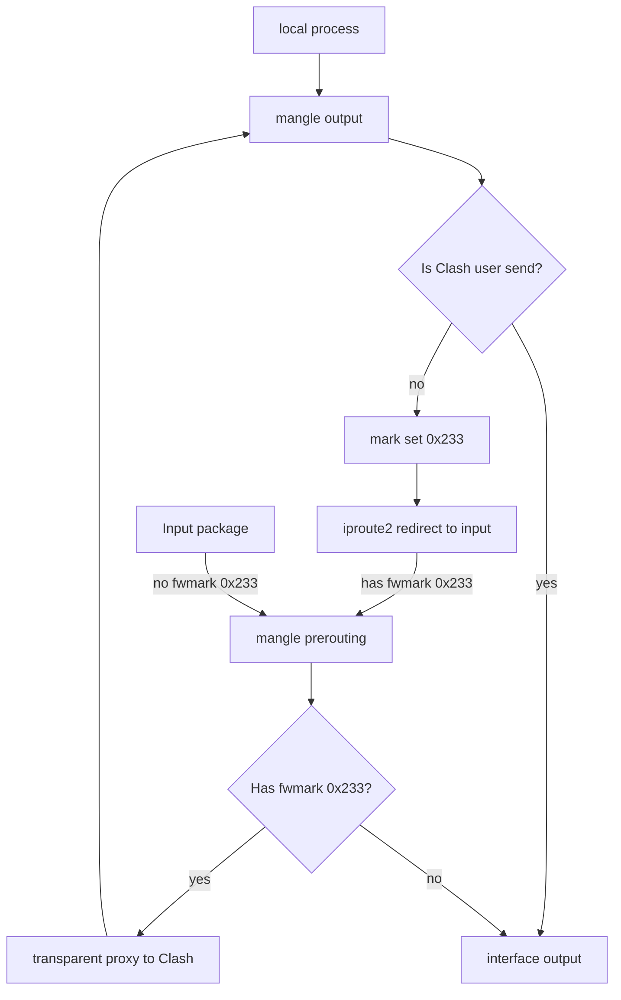

# 通过配置 Clash 和 Nftables 来配置透明代理
### 配置方法
1. 安装 `nftables` 包，可通过 `pacman -S iptables-nft` 来安装 `nftables` 并卸载 `iptables` 以避免冲突。
2. 安装 `clash` 包，可通过 `pacman -S clash` 安装。
3. 创建 `clash` 用户，可通过 `useradd -m -s /usr/bin/nologin clash` 创建。
4. 从服务商下载配置文件或者自己动手写配置文件，[并修改这些配置。](#clash-配置文件)
5. 创建 [systemd unit](#systemd-service)，可以按自己的情况进行修改
6. 运行下列命令：
```sh
systemctl daemon-reload
systemctl enable --now clash-tproxy.service
```
7. 现在透明代理就配置好了！

### nft规则
已经不太想说什么了，说多了都是泪啊！

参考：
- [Packet flow in Netfilter](https://upload.wikimedia.org/wikipedia/commons/3/37/Netfilter-packet-flow.svg)
- [Clash Wiki](https://github.com/Dreamacro/clash/wiki/Configuration)
- [nftables for redir proxy](https://gist.github.com/codehz/db39a6d5732ccbd6343f277b78f1eb19)
- [rocka/nft-transproxy](https://github.com/rocka/nft-transproxy)
- [Man of NFT](https://www.netfilter.org/projects/nftables/manpage.html#lbAS)

```nft
#!/bin/nft -f

flush ruleset

define private_list = {
0.0.0.0/8,
10.0.0.0/8,
127.0.0.0/8,
169.254.0.0/16,
172.16.0.0/12,
192.168.0.0/16,
224.0.0.0/4,
240.0.0.0/4,
}

define private_list6 = {
::/128,
::1/128,
fc00::/7,
fe80::/10,
ff00::/8,
}

table inet proxy {
	chain filter {
		ip daddr $private_list accept
		ip6 daddr $private_list6 accept
		return
	}

	chain output {
		type route hook output priority mangle; policy accept;
		meta skuid clash accept
		socket transparent 1 accept
		jump filter
		meta mark set 0x233
	}

	chain mangle-prerouting {
		type filter hook prerouting priority mangle; policy accept;
		jump filter
    	meta l4proto { tcp, udp } mark 0x233 tproxy ip to 127.0.0.1:7891
    	meta l4proto { tcp, udp } mark 0x233 tproxy ip6 to ::1:7891
	}

}
```
## 网络流程

## systemd service
```ini
[Unit]
Description=Clash with nftables proxy
After=network-online.target

[Service]
# start
ExecStartPre=setcap "CAP_NET_BIND_SERVICE+ep CAP_NET_ADMIN+ep" /bin/clash # 坑点1：缺少`CAP_NET_ADMIN`和`CAP_NET_BIND_SERVICE`权限，需要在这里允许。
ExecStartPre=/usr/local/lib/nft-transproxy/transproxy.nft
ExecStartPre=ip rule add fwmark 0x233 lookup 100
ExecStartPre=ip route add local 0.0.0.0/0 dev lo table 100
ExecStartPre=ip -6 rule add fwmark 0x233 lookup 100
ExecStartPre=ip -6 route add local ::/0 dev lo table 100
ExecStart=sudo -u clash clash -d /home/clash/.config/clash # 坑点2：在这里需要以clash用户身份执行
# reload
ExecReload=/usr/local/lib/nft-transproxy/transproxy.nft
# stop
ExecStopPost=nft flush ruleset
ExecStopPost=ip rule del fwmark 0x233 lookup 100
ExecStopPost=ip route del local 0.0.0.0/0 dev lo table 100
ExecStopPost=ip -6 rule del fwmark 0x233 lookup 100
ExecStopPost=ip -6 route del local ::/0 dev lo table 100
Restart=on-failure

[Install]
WantedBy=multi-user.target
```

### clash 配置文件
目前 clash 配置文件中最核心的部分就是这里了：
```yaml
tproxy-port: 7891
dns:
	listen: 0.0.0.0:53
```
