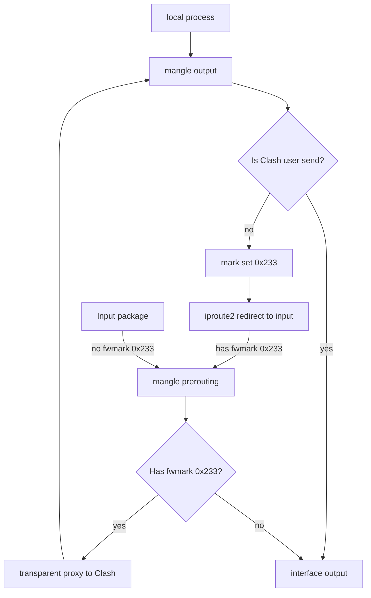

## 通过配置 Clash 和 NetfilterTable 来配置透明代理
nft规则，已经不太想说什么了，说多了都是泪啊！

```nft
#!/usr/sbin/nft -f

flush ruleset

define private_list = {
0.0.0.0/8,
10.0.0.0/8,
127.0.0.0/8,
169.254.0.0/16,
172.16.0.0/12,
192.168.0.0/16,
224.0.0.0/4,
240.0.0.0/4,
}

define private_list6 = {
::/128,
::1/128,
fc00::/7,
fe80::/10,
ff00::/8,
}

table ip mangle {
	chain filter {
		ip daddr $private_list accept
    	socket transparent 1 accept
		meta skuid clash accept
		return
	}

	chain output {
		type route hook output priority mangle; policy accept;
		jump filter
		meta mark set 0x233
	}

	chain prerouting {
		type filter hook prerouting priority mangle; policy accept;
		jump filter
    	meta l4proto { tcp, udp } mark 0x233 tproxy to :7891
	}
}

table ip6 mangle {
	chain filter {
		ip6 daddr $private_list6 accept
    	socket transparent 1 accept
		meta skuid clash accept
		return
	}

	chain output {
		type route hook output priority mangle; policy accept;
		jump filter
		meta mark set 0x233
	}

	chain prerouting {
		type filter hook prerouting priority mangle; policy accept;
		jump filter
    	meta l4proto { tcp, udp } mark 0x233 tproxy to :7891
	}
}
```



## systemd service
```ini
[Unit]
Description=Clash with nftables proxy
After=network-online.target

[Service]
# start
ExecStartPre=setcap CAP_NET_ADMIN=eip /bin/clash # 坑点1：缺少`CAP_NET_ADMIN`权限，需要在这里允许。
ExecStartPre=/usr/local/lib/nft-transproxy/transproxy.nft
ExecStartPre=ip rule add fwmark 0x233 lookup 100
ExecStartPre=ip route add local 0.0.0.0/0 dev lo table 100
ExecStartPre=ip -6 rule add fwmark 0x233 lookup 100
ExecStartPre=ip -6 route add local ::/0 dev lo table 100
ExecStart=sudo -u clash clash -d /home/clash/.config/clash # 坑点2：在这里需要以clash用户身份执行
# reload
ExecReload=/usr/local/lib/nft-transproxy/transproxy.nft
# stop
ExecStopPost=nft flush ruleset
ExecStopPost=ip rule del fwmark 0x233 lookup 100
ExecStopPost=ip route del local 0.0.0.0/0 dev lo table 100
ExecStopPost=ip -6 rule del fwmark 0x233 lookup 100
ExecStopPost=ip -6 route del local ::/0 dev lo table 100
Restart=on-failure

[Install]
WantedBy=multi-user.target
```

目前 clash 配置文件中最核心的部分就是这里了：
```yaml
tproxy-port: 7891
```
